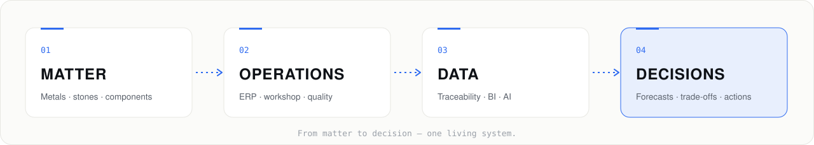
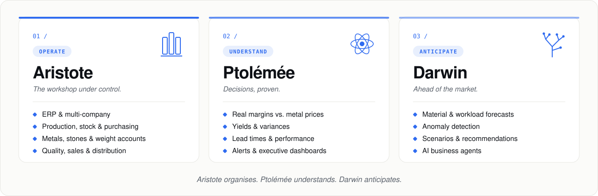
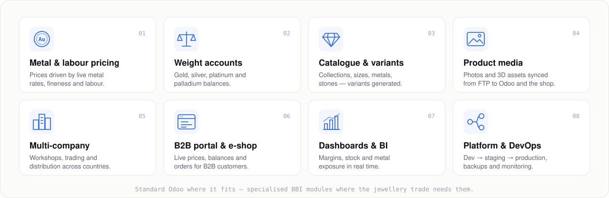
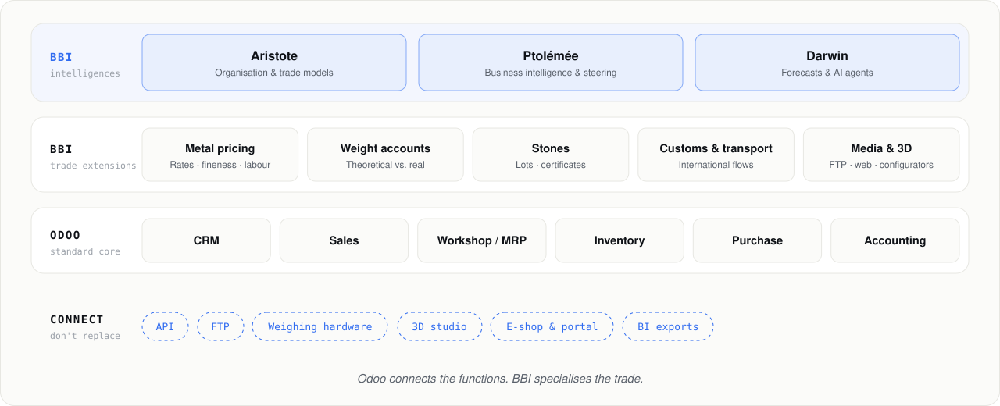

<a href="https://brothersbusinessintelligence.com/">
  <picture>
    <source media="(prefers-color-scheme: dark)" srcset="./assets/hero-dark.svg">
    
  </picture>
</a>

  
  
  

  <b>Brothers Business Intelligence</b> connects matter, production, transactions, data and decisions 
  in one continuous system — <b>from sourcing to distribution</b>. 
  Built on Odoo · specialised for precious metals, stones and multi-company, international operations.

 

## ◆ From matter to decision

<picture>
  <source media="(prefers-color-scheme: dark)" srcset="./assets/pipeline-dark.svg">
  
</picture>

## ◆ One system. Three intelligences.

<picture>
  <source media="(prefers-color-scheme: dark)" srcset="./assets/modules-dark.svg">
  
</picture>

## ◆ What we are building on Odoo

We are progressively turning Odoo into a complete platform for jewellery houses — one business need at a time.

<picture>
  <source media="(prefers-color-scheme: dark)" srcset="./assets/workstreams-dark.svg">
  
</picture>

## ◆ Architecture

<picture>
  <source media="(prefers-color-scheme: dark)" srcset="./assets/architecture-dark.svg">
  
</picture>

<table>
  <tr>
    <td width="33%" valign="top"><b>Odoo connects, BBI specialises</b> Keep standard modules where they fit; add only the specialised components the trade needs.</td>
    <td width="33%" valign="top"><b>Connect rather than replace</b> Core system, business layer on an existing Odoo, or the link between your specialised tools.</td>
    <td width="33%" valign="top"><b>Applied R&amp;D</b> Built and tested in the field, alongside real workshops.</td>
  </tr>
</table>

## ◆ How we work

| 01 · Listen | 02 · Model | 03 · Build | 04 · Test | 05 · Deploy |
|:--|:--|:--|:--|:--|
| Workshop, office and management needs | The trade translated into Odoo | Focused, maintainable modules | In real conditions, with real data | Continuous delivery and improvement |

## ◆ Stack

  
  
  
  
  
  
  

<b>🇫🇷 En français</b>

 

**Le système de pilotage des maisons de joaillerie.** BBI relie la matière, la production, les transactions, les données et les décisions dans une même continuité — du sourcing à la distribution.

- **Aristote — Opérer** : ERP multi-entreprise, production, stocks, achats, métaux, pierres et comptes-poids.
- **Ptolémée — Comprendre** : marges réelles corrélées au cours de l'or, rendements, écarts, tableaux de bord.
- **Darwin — Anticiper** : prévisions matière, détection d'anomalies, scénarios et agents d'IA.

**Nos chantiers sur Odoo** : prix indexés sur les cours des métaux et la façon · comptes-poids · catalogue et variantes joaillerie · médias produits automatisés · multi-sociétés et international · portail B2B et e-shop · tableaux de bord · déploiement et supervision automatisés.

*Odoo relie les fonctions. BBI spécialise le métier.*

 

<a href="https://brothersbusinessintelligence.com/">
  <picture>
    <source media="(prefers-color-scheme: dark)" srcset="./assets/footer-dark.svg">
    
  </picture>
</a>

  © Brothers Business Intelligence · <a href="mailto:admin@brothersbusinessintelligence.com">admin@brothersbusinessintelligence.com</a>

