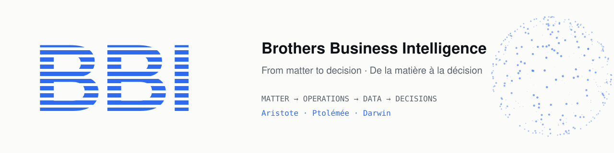

  <a href="https://brothersbusinessintelligence.com/">
    <picture>
      <source media="(prefers-color-scheme: dark)" srcset="./assets/banner-dark.svg">
      
    </picture>
  </a>

  <b>Technology reveals an invisible world.</b> 
  <i>La technologie révèle un monde invisible.</i>

  
  
  

---

### The steering system for jewellery houses

**Brothers Business Intelligence (BBI)** connects matter, production, transactions, data and decisions in one continuous system — from sourcing to distribution. Built on **Odoo**, specialised for precious metals, stones and multi-company, international operations.

> Matter becomes gesture. Gesture becomes data. Data becomes knowledge. Knowledge becomes decision.

### One system. Three intelligences.

| | Module | Role | What it covers |
|:-:|---|---|---|
| **01** | **Aristote** | *Operate* | ERP & multi-company · production, stock & purchasing · metals, stones & weight accounts · quality, sales & distribution |
| **02** | **Ptolémée** | *Understand* | Business intelligence · real margins vs. metal prices · yields & variances · executive dashboards & alerts |
| **03** | **Darwin** | *Anticipate* | Forecasting of metals, stones & components · anomaly detection · scenarios & recommendations · AI agents |

<i>Aristote organises. Ptolémée understands. Darwin anticipates.</i>

### Principles

- **Odoo connects the functions, BBI specialises the trade** — keep standard modules where they fit, add only the specialised components needed.
- **Connect rather than replace** — BBI can be the core system, a business layer on an existing Odoo, or the link between your specialised tools (3D, FTP, APIs, weighing hardware).
- **Applied R&D** — built and tested in the field, alongside real workshops.

### Stack

  
  
  
  
  
  
  

---

<b>🇫🇷 En français</b>

 

**Le système de pilotage des maisons de joaillerie.** BBI relie la matière, la production, les transactions, les données et les décisions dans une même continuité — du sourcing à la distribution.

- **Aristote — Opérer** : ERP multi-entreprise, production, stocks, achats, métaux, pierres et comptes-poids.
- **Ptolémée — Comprendre** : marges réelles corrélées au cours de l'or, rendements, écarts, tableaux de bord.
- **Darwin — Anticiper** : prévisions matière, détection d'anomalies, scénarios et agents d'IA.

*Odoo relie les fonctions. BBI spécialise le métier.*

  © Brothers Business Intelligence · <a href="https://brothersbusinessintelligence.com/">brothersbusinessintelligence.com</a> · <a href="mailto:contact@brothersbusinessintelligence.com">contact@brothersbusinessintelligence.com</a>

